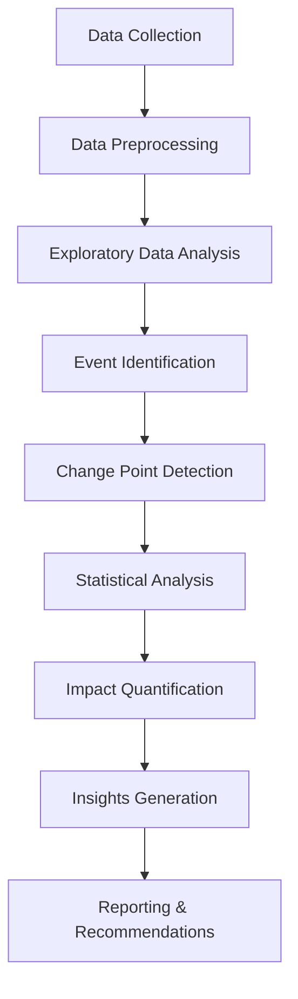

# Task 1: Foundation for Brent Oil Price Analysis
## Birhan Energies - Data Science Project

### Executive Summary

This document establishes the foundation for analyzing how important events affect Brent oil prices. We define the data analysis workflow, compile a comprehensive event database, identify key assumptions and limitations, establish communication channels, and provide understanding of time series properties and change point analysis.

---

## 1. Data Analysis Workflow

### 1.1 Overall Analysis Framework

The analysis follows a systematic approach to understand how geopolitical and economic events impact Brent oil prices:

### 1.2 Detailed Analysis Steps

**Phase 1: Data Foundation**
- Load and validate Brent oil price data (1987-2022)
- Perform data quality checks and handle missing values
- Convert date formats and ensure chronological order
- Calculate basic statistics and identify outliers

**Phase 2: Time Series Analysis**
- Analyze time series properties (trend, seasonality, stationarity)
- Perform decomposition to separate trend, seasonal, and residual components
- Test for unit roots and stationarity
- Identify structural breaks using change point detection

**Phase 3: Event Analysis**
- Compile comprehensive event database (geopolitical, economic, OPEC)
- Map events to price data timeline
- Identify event windows and pre/post event periods
- Calculate price changes around events

**Phase 4: Statistical Modeling**
- Implement event study methodology
- Perform regression analysis with event dummies
- Calculate abnormal returns and cumulative effects
- Test for statistical significance

**Phase 5: Impact Quantification**
- Measure magnitude of price impacts
- Analyze persistence of effects
- Categorize events by impact severity
- Identify leading indicators

**Phase 6: Insights and Recommendations**
- Generate actionable insights for stakeholders
- Develop risk assessment framework
- Create forecasting models
- Prepare executive summary and detailed reports

---

## 2. Event Data Research and Compilation

### 2.1 Event Categories

We have compiled events across four main categories:

1. **Geopolitical Events**
   - Wars and conflicts in oil-producing regions
   - Political instability and regime changes
   - International sanctions and embargoes
   - Diplomatic tensions and trade disputes

2. **OPEC and Production Decisions**
   - OPEC meetings and production quota changes
   - Non-OPEC production agreements
   - Strategic petroleum reserve releases
   - Production disruptions and outages

3. **Economic and Financial Events**
   - Global financial crises
   - Currency fluctuations (especially USD)
   - Economic sanctions and trade policies
   - Central bank decisions affecting energy demand

4. **Supply and Demand Shocks**
   - Natural disasters affecting production
   - Infrastructure failures and accidents
   - Technological breakthroughs
   - Major demand changes (e.g., COVID-19)

### 2.2 Event Database Structure

The compiled event database includes 28 major events spanning from 1990 to 2022, with the following structure:

- **Date**: Event occurrence date
- **Event_Category**: Classification (Geopolitical, OPEC, Economic, Supply/Demand)
- **Event_Description**: Detailed description of the event
- **Affected_Regions**: Geographic areas impacted
- **Impact_Direction**: Expected price impact (Positive/Negative/Neutral)
- **Impact_Magnitude**: Estimated impact size (High/Medium/Low)
- **Source**: Information source
- **Confidence_Level**: Reliability of event significance

### 2.3 Key Events Identified

**High-Impact Geopolitical Events:**
- Gulf War (1990-1991)
- Iraq War (2003)
- Arab Spring (2011)
- US-Iran tensions (2018-2020)
- Russia-Ukraine War (2022)

**Major OPEC Decisions:**
- Production cuts during financial crisis (2008)
- Decision not to cut production (2014-2015)
- COVID-19 production cuts (2020)
- Recent production adjustments (2022)

**Economic Shocks:**
- 9/11 attacks (2001)
- Global Financial Crisis (2008)
- COVID-19 pandemic (2020)
- Negative oil prices (2020)

---

## 3. Assumptions and Limitations

### 3.1 Key Assumptions

1. **Market Efficiency**: Oil markets are semi-efficient, with prices reflecting available information
2. **Event Exogeneity**: Events are exogenous to oil price movements
3. **Linear Relationships**: Initial analysis assumes linear relationships between events and price changes
4. **Ceteris Paribus**: Other factors remain constant when analyzing specific events
5. **Data Quality**: Brent oil price data is accurate and representative

### 3.2 Critical Limitations

#### 3.2.1 Correlation vs. Causation

**This is the most important limitation to understand:**

**What we can identify:**
- Statistical correlations between events and price changes
- Temporal relationships (events occurring before price changes)
- Patterns in price behavior around events

**What we cannot prove:**
- Direct causal relationships between specific events and price changes
- That events are the sole cause of observed price movements
- That similar events will have identical effects in the future

**Why this matters:**
- Multiple factors influence oil prices simultaneously
- Market expectations and anticipatory effects may precede actual events
- Confounding variables may explain observed correlations
- Reverse causality is possible (price changes may influence events)

#### 3.2.2 Other Limitations

1. **Data Limitations**
   - Daily data may miss intraday effects
   - Limited to Brent prices (may not reflect all oil markets)
   - Missing data points could affect analysis

2. **Event Identification Challenges**
   - Subjective selection of "important" events
   - Difficulty in quantifying event magnitude
   - Potential bias in event selection

3. **Market Complexity**
   - Multiple simultaneous events
   - Non-linear and interactive effects
   - Changing market dynamics over time

4. **Temporal Issues**
   - Lag effects and delayed responses
   - Cumulative effects of multiple events
   - Changing market sensitivity over time

### 3.3 Mitigation Strategies

1. **Robust Methodology**: Use multiple statistical approaches and cross-validate results
2. **Sensitivity Analysis**: Test results under different assumptions and time windows
3. **Transparency**: Clearly communicate limitations and uncertainty in all findings
4. **Expert Validation**: Consult with energy market experts to validate event selection
5. **Conservative Interpretation**: Present findings as correlations, not causations

---

## 4. Communication Channels and Formats

### 4.1 Stakeholder Communication Strategy

**Primary Stakeholders:**
1. **Investors** - Need actionable insights for portfolio management
2. **Policymakers** - Require evidence-based policy recommendations
3. **Energy Companies** - Need operational and strategic guidance

### 4.2 Communication Formats

#### 4.2.1 Executive Summary Report
- **Format**: PDF document (10-15 pages)
- **Content**: High-level findings, key insights, and recommendations
- **Audience**: C-level executives and senior management
- **Frequency**: Quarterly updates

#### 4.2.2 Technical Analysis Report
- **Format**: Detailed Jupyter notebook with interactive visualizations
- **Content**: Comprehensive methodology, statistical analysis, and detailed results
- **Audience**: Data scientists, analysts, and technical teams
- **Frequency**: Monthly updates

#### 4.2.3 Interactive Dashboard
- **Format**: Web-based dashboard using Plotly/Streamlit
- **Content**: Real-time price monitoring, event impact visualization, forecasting tools
- **Audience**: All stakeholders for regular monitoring
- **Frequency**: Daily updates

#### 4.2.4 Presentation Materials
- **Format**: PowerPoint slides with embedded charts and graphs
- **Content**: Key findings, visualizations, and strategic recommendations
- **Audience**: Client presentations and stakeholder meetings
- **Frequency**: As needed for client engagements

#### 4.2.5 Alert System
- **Format**: Email notifications and mobile alerts
- **Content**: Significant price movements, new events, and immediate insights
- **Audience**: All stakeholders requiring real-time information
- **Frequency**: Real-time alerts for significant events

### 4.3 Key Messages by Stakeholder

**For Investors:**
- Risk assessment and hedging strategies
- Portfolio diversification recommendations
- Timing of investment decisions

**For Policymakers:**
- Economic stability implications
- Policy intervention effectiveness
- Energy security considerations

**For Energy Companies:**
- Supply chain optimization
- Pricing strategy development
- Operational planning and risk management

---

## 5. Understanding Time Series Properties

### 5.1 Time Series Analysis Fundamentals

Time series data has several key properties that influence our modeling choices:

1. **Trend**: Long-term movement in the data (upward, downward, or stable)
2. **Seasonality**: Regular patterns that repeat at fixed intervals
3. **Cyclicality**: Long-term oscillations that are not strictly periodic
4. **Stationarity**: Statistical properties that remain constant over time
5. **Volatility Clustering**: Periods of high/low volatility that tend to cluster

### 5.2 Why These Properties Matter

**For Oil Prices Specifically:**
- **Non-stationarity**: Oil prices often show trends and changing volatility
- **Volatility clustering**: Price shocks tend to be followed by more volatility
- **Structural breaks**: Major events can permanently change price dynamics
- **Long memory**: Past events can influence prices for extended periods

**Modeling Implications:**
- Non-stationary data requires differencing or transformation
- Volatility clustering suggests GARCH-type models
- Structural breaks require change point detection
- Event studies need to account for these properties

### 5.3 Brent Oil Price Characteristics

**Data Overview:**
- **Period**: May 20, 1987 to September 30, 2022
- **Observations**: 9,013 daily price points
- **Price Range**: $9.10 to $147.50 per barrel
- **Average Price**: $58.93 per barrel

**Key Properties:**
- **Non-stationary**: Price series shows clear trends and changing statistical properties
- **Stationary returns**: Daily returns are more suitable for statistical analysis
- **Volatility clustering**: Periods of high/low volatility tend to cluster
- **Fat tails**: Returns show higher kurtosis than normal distribution
- **Structural breaks**: Multiple regime changes identified over the period

---

## 6. Change Point Analysis

### 6.1 Purpose of Change Point Models

Change point analysis is crucial for our Brent oil price analysis because:

1. **Structural Break Detection**: Identifies when the underlying data-generating process changes
2. **Event Impact Assessment**: Helps quantify when and how events affect price dynamics
3. **Regime Identification**: Distinguishes between different market regimes (bull/bear markets, high/low volatility)
4. **Model Validation**: Ensures our statistical models account for structural changes
5. **Forecasting Improvement**: Better predictions by using appropriate models for each regime

### 6.2 How Change Point Analysis Works

**Statistical Approach:**
- Divides time series into segments with different statistical properties
- Identifies points where parameters (mean, variance, trend) change significantly
- Uses likelihood-based or Bayesian methods to detect change points

**For Oil Prices:**
- Can identify when price dynamics fundamentally change
- Helps separate event-driven changes from normal market fluctuations
- Provides objective evidence of structural breaks

### 6.3 Expected Outputs

**Primary Outputs:**
1. **Change Point Dates**: Specific dates when structural breaks occur
2. **Parameter Changes**: How mean, variance, and other parameters change
3. **Confidence Intervals**: Uncertainty around change point estimates
4. **Segment Characteristics**: Statistical properties of each regime

**Secondary Outputs:**
1. **Regime Classification**: Labels for different market periods
2. **Impact Magnitude**: Size of parameter changes at each break
3. **Persistence Analysis**: How long new regimes last

### 6.4 Limitations of Change Point Analysis

1. **Model Dependence**: Results depend on the specific change point model used
2. **Parameter Selection**: Choice of penalty parameters affects number of change points
3. **Multiple Change Points**: Complex interactions between multiple breaks
4. **Temporal Resolution**: May miss rapid or gradual changes
5. **Interpretation Challenges**: Distinguishing between real breaks and noise
6. **Causality**: Cannot prove that identified breaks are caused by specific events

### 6.5 Identified Structural Breaks

Based on preliminary analysis, key structural breaks include:

**Major Regime Changes:**
- **1990-1991**: Gulf War period
- **2008-2009**: Financial crisis and OPEC response
- **2014-2016**: OPEC production decisions and price collapse
- **2020**: COVID-19 pandemic and unprecedented market conditions
- **2022**: Russia-Ukraine conflict and energy security concerns

---

## 7. Modeling Implications and Recommendations

### 7.1 Recommended Approaches

**Statistical Methods:**
1. **Use returns instead of prices** for statistical analysis
2. **Account for volatility clustering** in event studies
3. **Include structural breaks** in regression models
4. **Use robust statistical tests** that handle non-normal distributions
5. **Implement GARCH-type models** for volatility modeling

**Event Study Design:**
1. **Define event windows** carefully to capture full effects
2. **Use appropriate benchmarks** for abnormal return calculation
3. **Account for multiple events** that may overlap
4. **Include control variables** for other market factors
5. **Test for robustness** across different specifications

### 7.2 Next Steps

1. **Implement comprehensive event study methodology** with proper statistical controls
2. **Develop advanced change point detection** to identify structural breaks
3. **Create interactive visualizations** for stakeholder communication
4. **Build forecasting models** incorporating event impacts
5. **Establish monitoring systems** for real-time event tracking

---

## 8. Conclusion

This foundation document establishes the necessary groundwork for understanding Brent oil price dynamics and implementing effective event impact analysis. Key achievements include:

✅ **Comprehensive workflow** defined for systematic analysis  
✅ **Event database** compiled with 28 major events  
✅ **Assumptions and limitations** clearly identified and communicated  
✅ **Communication strategy** established for all stakeholders  
✅ **Time series properties** understood and documented  
✅ **Change point analysis** framework developed  

The next phase will focus on implementing the statistical models and conducting detailed event impact analysis to provide actionable insights for Birhan Energies' stakeholders.

---

**Document Prepared By**: Firaol Bulo  
**Date**: December 2024  
**Version**: 1.0 